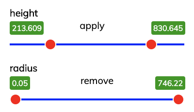

# Marko Slider

Slider widget for markojs.

## Install

```bash
npm i marko-slider
```

## Usage

```javascript
class {
  handleEvent(e){
    console.log(e.filterName) // height
    console.log(e.filterValues) // [value1, value2]
    // note - filterValues is empty if remove is clicked
  }
}
<slider filterName="height"
        displayName="Height"
        filterStats={ min: 10, max: 20 }
        on-filter-obliterate("handleEvent")/>
```

## Minimum styling is applied



- `.slider-box` - size of the slider container.
- `.slider-line` - blue line
- `.slider-point` - red circle with white outline
- `.slider-value-box` - green value box
